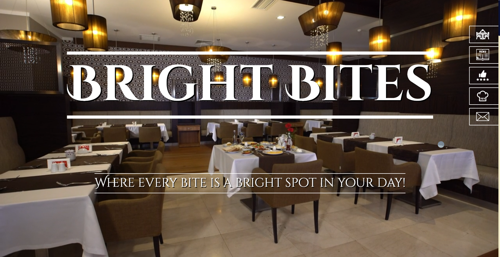
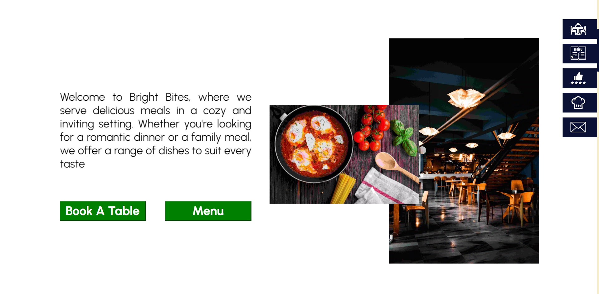
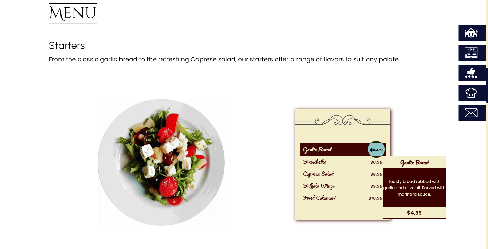
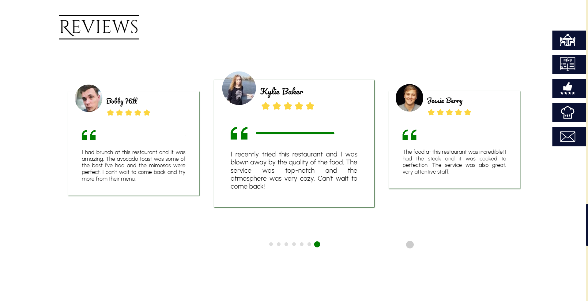
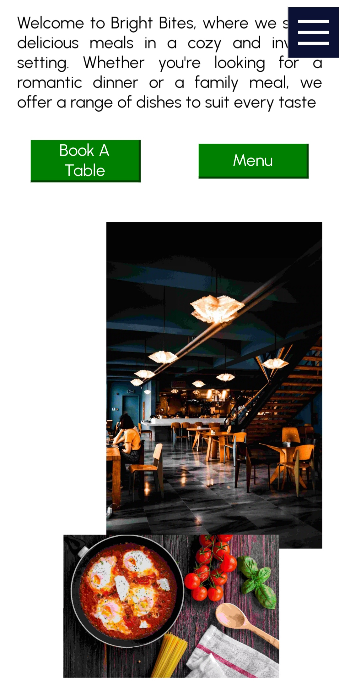
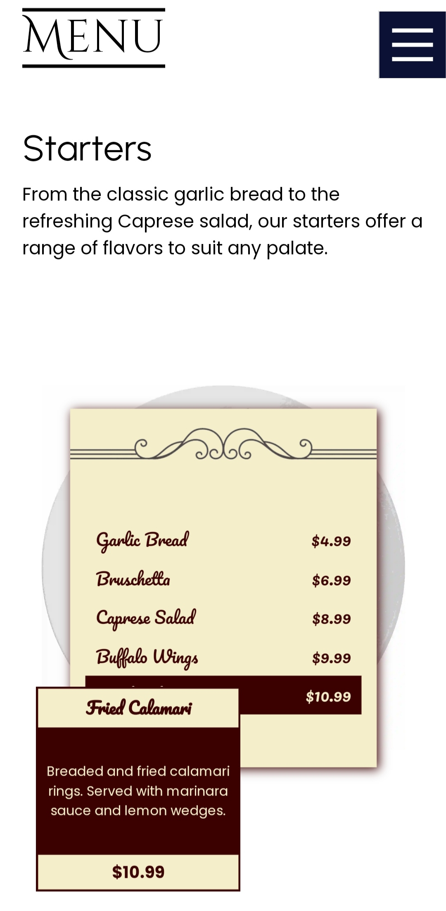
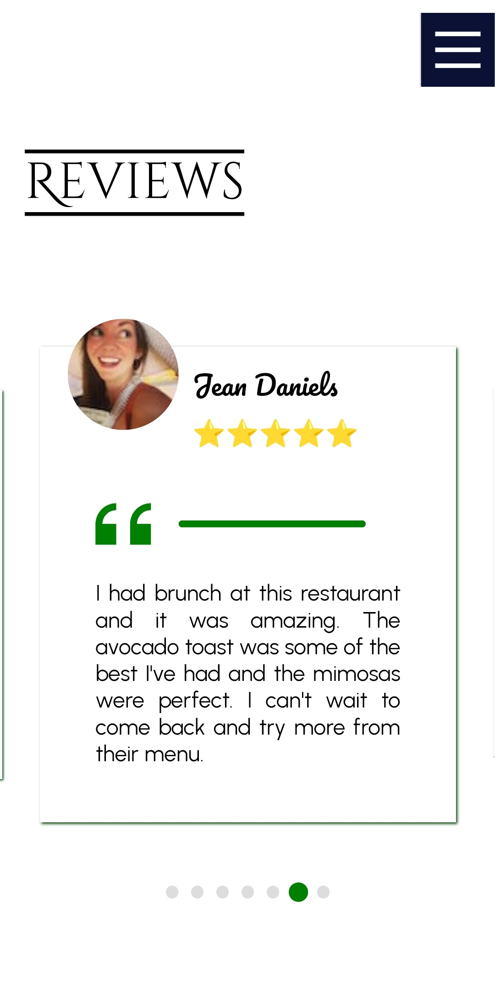

# Bright Bites

Bright Bites is a modern restaurant website that offers a range of features such as menus, reservation systems, and customer reviews. With sleek animations and a user-friendly interface, it provides an immersive and enjoyable experience for visitors and is optimized with core web vitals in mind.

For live site view, [Click here](https://sagar969.github.io/Bright-Bites/)

## Table of contents

- [Overview](#overview)
  - [The product](#the-product)
  - [Screenshot](#screenshot)
  - [Links](#links)
- [My process](#my-process)
  - [Built with](#built-with)
  - [What I learned](#what-i-learned)
  - [Continued development](#continued-development)
  - [Useful resources](#useful-resources)
- [Author](#author)

## Overview

### The product

Bright Bites is a modern and sleek restaurant website that offers a complete digital experience to customers. With a beautifully designed interface, the website includes all the necessary features of a restaurant website, such as menu options, reservations, and reviews.

The website's stunning animations and great user experience make it stand out from other restaurant websites. It is a perfect example of how a restaurant can create a strong online presence and engage with its customers through an elegant and functional website. Whether you are a restaurant owner or a customer, this website is a must-visit.

### Screenshot

This website is responsive to every screen size.
Desktop and Mobile view -

#### Desktop View

#### Mobile View

### Links

- Source code URL: [Source code](https://github.com/Sagar969/Bright-Bites)
- Live Site URL: [Live site](https://sagar969.github.io/Bright-Bites/)

## My process

### Built with

- [React](https://react.dev/) - JS library
- [TypeScript](https://www.typescriptlang.org/) - Strongly static typed language build on JavaScript
- [Sass](https://sass-lang.com/) - Syntactically Awesome Stylesheet
- [parallax-scroll](https://www.npmjs.com/package/react-scroll-parallax) - for animations while scrolling

##### Tools used
- [PageSpeed](https://pagespeed.web.dev/), [GTMetrix](https://gtmetrix.com/), [Lighthouse](https://developer.chrome.com/docs/lighthouse/overview/) - for performance insights and optimization tips
- [React developer tools](https://react.dev/learn/react-developer-tools) - for debugging

### What I learned

- Learned about type checking and error preventing in TypeScript.
- Learned 3d animations in css and implemented the same for menu  card animations.
- Learned carousel loop and used that in Reviews section.
- Learned about some more DOM events and their use cases.
- Learned about assets optimazition, minifying code and tree shaking.
- Learned about core web vitals like - LCP, FID, CLS.
- Learned some optimization techniques suggested from the google Lighthouse and pagespeed insights.

### Continued development

For future development process, I'll continue using TypeScript. I enjoyed working with it a lot. I'll focus more on optimizing the product based on the product type and platforms.

### Useful resources

- [Core Web Vitals](https://www.youtube.com/watch?v=AQqFZ5t8uNc&pp=ygUWY29yZSB3ZWIgdml0YWxzIGdvb2dsZQ%3D%3D) - Optimization guide for core web vitals from Google.
- [Optimizing LCP](https://www.youtube.com/watch?v=fWoI9DXmpdk&pp=ygUWY29yZSB3ZWIgdml0YWxzIGdvb2dsZQ%3D%3D) - A deep dive into optimizing LCP from Google.
- [Reduce bundle size](https://blog1.westagilelabs.com/3-tips-to-reduce-your-react-bundles-size-2647e68d3215) - Guide to reduce production build size drastically. Helped me reducing mine from 5mb to 300kb.

## Author

- Profile - [Sagar Mavai](https://github.com/Sagar969/)
- LinkedIn - [Sagar Mavai](https://www.linkedin.com/in/sagar-mavai-986b25206)
- Twitter - [@sagarmavai](https://www.twitter.com/sagarmavai)